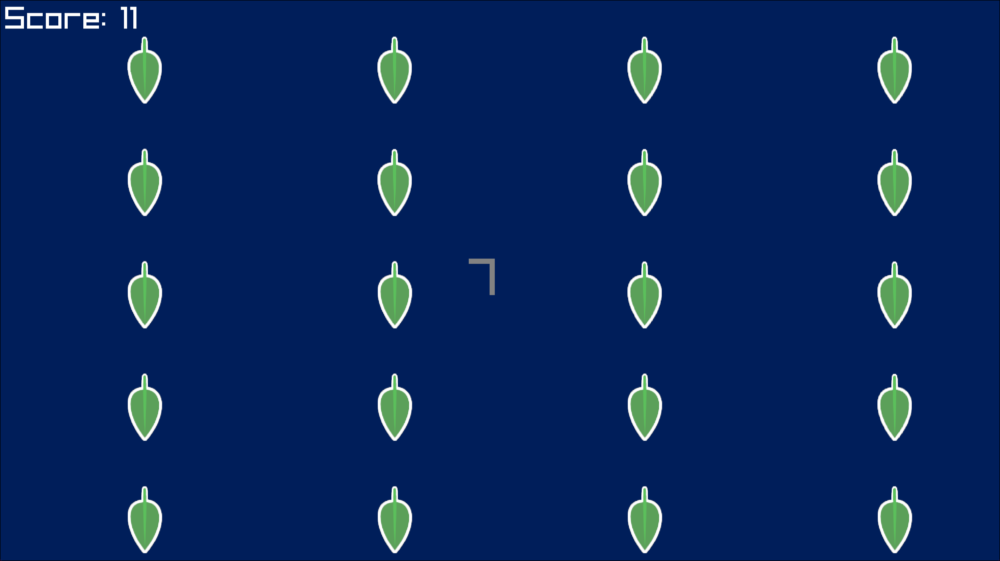

# Ebb and Flow

**A recreation of Lumosity's Ebb and Flow brain game**

## Installation and Usage

For Windows and Linux users on x86, there are archives in the releases page that include an assets folder and an executable. Extract the archive and run the executable to play. If that's not possible, you can clone the repository with git, get the latest release of raylib on their [github](https://github.com/raysan5/raylib/releases/latest), and compile main.c with raylib included/installed to get an executable for your OS and/or architecture.

Once you're in, the game is very simple: There are leaves that scroll by the screen, either going up, down, left, or right. Depending on whether the leaves are green or orange, you use the arrow keys to input a direction:

>If the leaves are green, press the arrow keys in the direction they're *pointing*.
>
>If the leaves are orange, press the arrow keys in the direction they're *moving*.

Every time you input a direction, the leaves' orientation and movement are randomized. After 30 seconds, your time is up, and your score and accuracy is shown.
